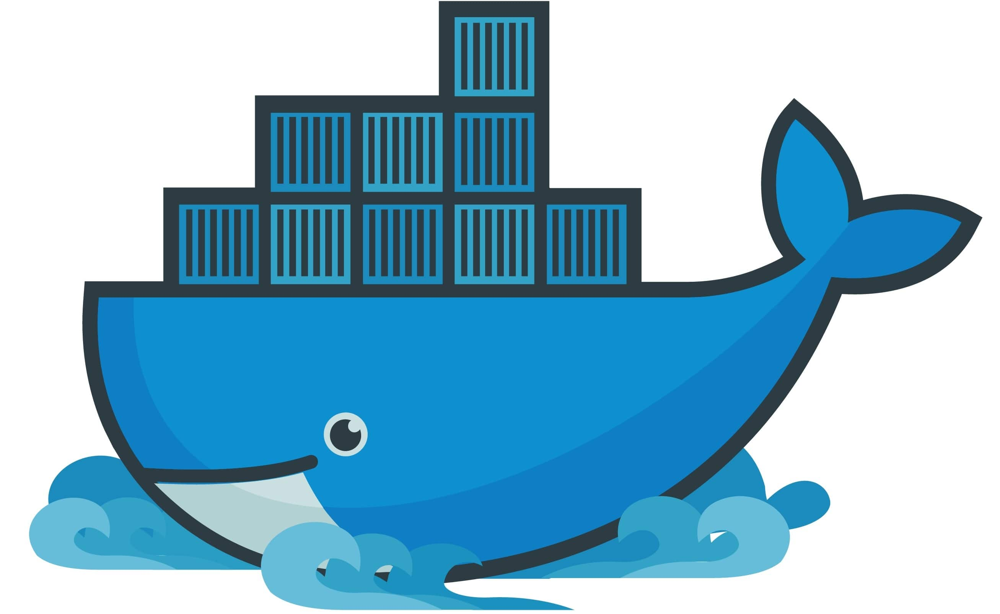

 
 

##  介绍本项目
  本项目以`centos7`为主容器，集成了`sqlserver`扩展驱动，`swoole`、`php`、`mysql`、`redis`、`nginx`等等组件 , 所有配置文件在项目中的`conf`，请自行进行配置,也可以在此基础上增加其他组件，centos部署环境就是这么简单

##  docker详细官方教程
 * ##  [查详细教程](http://www.docker.org.cn/book/)

## 1、安装docker
*  ##  [点击下载](https://download.docker.com/win/stable/Docker%20for%20Windows%20Installer.exe)

### 2、设置代理
  *  安装后完成等待下角鲸鱼图标启动完成，
  *  然后在右下角鲸鱼图标按右键 点击`Strings` , 在界面的左边栏目找到`Daemon`
     在右边`Registry mirrosrs`添加
     ### `http://f1361db2.m.daocloud.io`

### 3、启动docker容器文件
   * 建议使用`vscode编辑器`，然后在vscode安装`docker`扩展，这样你会少打很多合命令
   * 命行进入项目 cd /docker_centos_myserver , 输入 `docker-compose up`  或者`docker-compose up --build` 
   * 到此，等待容器构建完成即可 
   * 完成访问：     [http://127.0.0.1/](http://127.0.0.1/)

### 4、注意事项
   * ###  `本项目默认使用80、9501、3306端口来挡挂载演试，请保证80、9501、3306,保证端口不要被占用，否则容器动会启动失败`，可在 docker-compose.yml自行更改端口
   * ###  `MYSQL是另一个容易，连php连接mysql时，输入127.0.0.1是错误，应该是容器名称（mysql）`

### 项目作者
  * `岑明`
  * 2019/3/10 0:12

